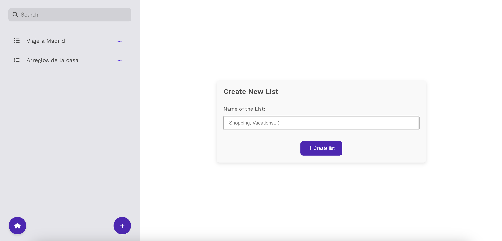

# TaskMaster



**TaskMaster** is a powerful and user-friendly to-do list application designed to simplify and organize your tasks. With TaskMaster, you can create, share, and manage your tasks efficiently, ensuring that you stay on top of everything you need to do.

## Table of Contents

- [Features](#features)
- [Built With](#built-with)
- [Installation](#installation)
- [Usage](#usage)
- [License](#license)
- [Contact](#contact)

## Features

- **Create Lists**: Add new lists to keep your tasks organized.
- **Delete and Share Lists**: Remove lists you no longer need or share them with others for collaborative task management.
- **View All Lists**: Access all your created lists in the sidebar on the left, making it easy to navigate between them.
- **Search with Filter**: Use the search filter to quickly find specific lists within your collection.
- **Add and Complete Tasks**: After creating a list, add tasks to it. When a task is completed, click the button to strike it through.
- **Delete Tasks**: Remove tasks with a trash icon if you prefer not to keep them in the list after completion.

## Built With

- **React**: Core framework for building the UI.
- **Sass**: Styling for enhanced design flexibility.
- **Vite**: For fast and optimized development.
- **React Router**: For smooth and efficient routing.
- **ESLint**: For consistent code quality and formatting.
- **Font Awesome**: Used for intuitive icons.

## Installation

1. Clone the repository:

```bash
   git clone https://github.com/Ginagonzalezgut/To-do-list
```

2. Navigate to the project directory:

```bash
cd To-do-list
```

3. Install the dependencies:

```bash
npm install
```

4. Run the application:

```bash
npm run dev
```

5. Open the application in your browser at http://localhost:5175.

## Usage

1. **Creating a New List**: Enter a name for your list and click "Create List" to add it.

2. **Managing Tasks**:

- Click on a list to view and manage its tasks.
- Add tasks by typing and pressing "Add Task."
- Strike through completed tasks by checking the task.
- Delete tasks with the trash icon.

3. **Filtering Lists:** Use the search bar to filter lists and quickly locate specific ones.

## License

This project is licensed under the MIT License.

## Contact

For any questions, suggestions, or issue reports, please feel free to contact:

- [Gina González](https://github.com/Ginagonzalezgut)
